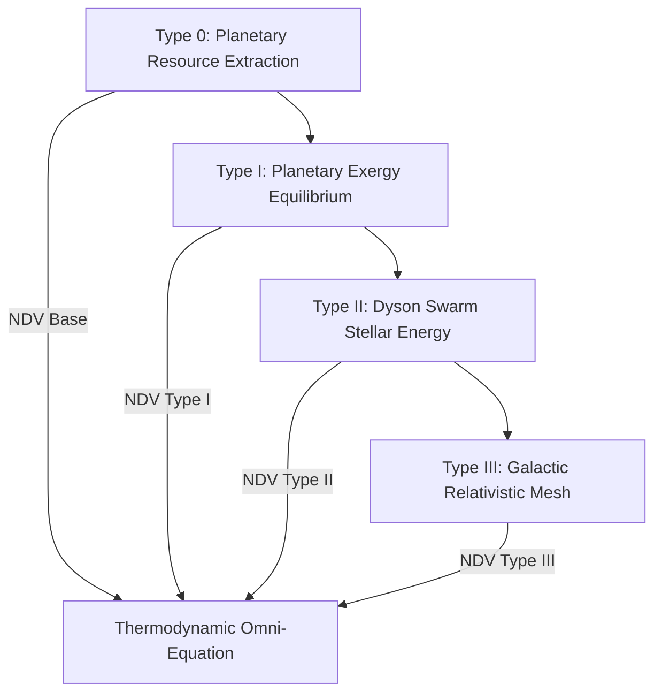

# The Cosmological Scaling of Net Domestic Value (NDV) across the Kardashev Scale

Standard macroeconomic accounting (GDP) collapses outside of a 20th-century planetary paradigm because it measures fiat transactions rather than physical work and information structure. 

Because **Net Domestic Value (NDV)** is grounded in the **First and Second Laws of Thermodynamics** and **Shannon Information Entropy**, it is *scale-invariant*. It governs economic value whether an economy is a local tribe, a Type I planetary civilization, a Type II Dyson-Swarm stellar economy, or a Type III Galactic network.

---

## The Kardashev Hierarchy of Wealth

---

## 1. Type I Civilization: Planetary Exergy Equilibrium (\(\approx 10^{16}\text{ Watts}\))

As humanity captures the full power incident on Earth (solar insolation \(\approx 1.74 \times 10^{17}\text{ W}\) plus fusion), GDP becomes meaningless because energy scarcity disappears. However, **NDV becomes strictly binding** due to **Landauer's Principle** and the **Planetary Heat Dissipation Limit**:

- **Thermal Dissipation Drag (\(E_{\text{thermal}}^-\))**: All compute and industrial work generates waste heat. Radiating \(10^{16}\text{ W}\) into space without elevating Earth's mean temperature requires orbital sunshades or exergy-constrained compute.
- **Type I NDV Formulation**:
  \[
  \text{NDV}_{\text{Type I}} = \left(P_{\text{solar}} + P_{\text{fusion}}\right) \cdot \eta_{\text{exergy}} - \left(D_p + D_{\text{biosphere}} + D_{\text{compute}}\right) - T_{\text{planetary}} \cdot \frac{dS_{\text{dissipation}}}{dt}
  \]

---

## 2. Type II Civilization: Stellar Dyson-Swarm Economy (\(\approx 10^{26}\text{ Watts}\))

A Type II civilization encapsulates its parent star (e.g. a Dyson Swarm around the Sun).

- **Relativistic Latency Entropy (\(D_{\text{latency}}\))**: At stellar scales (tens of Astronomical Units), information takes hours to travel between orbital compute nodes at light speed (\(c\)). Maintaining distributed ledger state consensus across 30 AU introduces **Light-Speed Synchronization Drag**:
  \[
  D_{\text{latency}} = \sum_{i,j} \frac{d_{ij}}{c} \cdot H(X_{ij}) \cdot k_B T \ln(2)
  \]
- **Type II NDV Formulation**:
  \[
  \text{NDV}_{\text{Type II}} = \left(L_{\text{star}} \cdot \Omega_{\text{swarm}}\right) \cdot \left(1 - \frac{1}{\text{EROI}_{\text{dyson}}}\right) - \left(D_{\text{orbital\_maintenance}} + D_{\text{latency}} + D_{\text{stellar\_flares}}\right)
  \]

---

## 3. Type III Civilization: Galactic Relativistic Mesh (\(\approx 10^{36}\text{ Watts}\))

A Type III civilization harnesses the exergy of billions of stars and black hole accretion disks (Penrose Process).

- **General Relativistic Time Dilation (\(D_{\text{relativistic}}\))**: Time moves at different rates near supermassive black holes (e.g. Sagittarius A*) compared to outer spiral arms. 
- **Cosmic Heat Death & Horizon Limit**: Wealth is defined by how effectively exergy is preserved against the accelerated expansion of space (Dark Energy).
- **Type III Universal NDV Formulation**:
  \[
  \text{NDV}_{\text{Type III}} = \int_{\text{Galaxy}} \sqrt{-g} \left[ \mathbf{T}^{\mu\nu} u_\mu k_\nu \cdot \eta_{\text{exergy}} - \nabla_\mu S^\mu_{\text{entropy}} \right] d^4x
  \]
  Where \(\mathbf{T}^{\mu\nu}\) is the stress-energy tensor of all star systems, \(g\) is the spacetime metric, and \(\nabla_\mu S^\mu\) is cosmic entropy generation.

---

## Summary Matrix

| Kardashev Level | Primary Energy Source | Binding Physical Constraint (NDV Drag) | Dominant Dividends (\(E^+\)) |
| :--- | :--- | :--- | :--- |
| **Type 0.75 (Now)** | Fossil Fuels & Solar | Planetary Boundaries & Attention Extraction (\(D_c, D_n\)) | Care Economics & Biosphere Regeneration |
| **Type I** | Stellar Insolation & Fusion | Planetary Thermal Dissipation Limit & Landauer Drag | Post-Scarcity Abundance & Cognitive Synthesis |
| **Type II** | Dyson Swarm Stellar Output | Light-Speed Latency Entropy (\(D_{\text{latency}}\)) | Star-Scale Computation & Interplanetary Infrastructure |
| **Type III** | Black Hole Penrose & Galaxies | Relativistic Spacetime Dilation & Cosmic Heat Death | Spacetime Preservation & Multi-System Harmony |

### Conclusion
**Yes.** Because Net Domestic Value is derived from fundamental physics (Exergy, Entropy, and Information Theory), it does not expire when fiat currencies or planet-bound GDP metrics become obsolete. It is the universal equation of wealth for any intelligent civilization in the cosmos.
