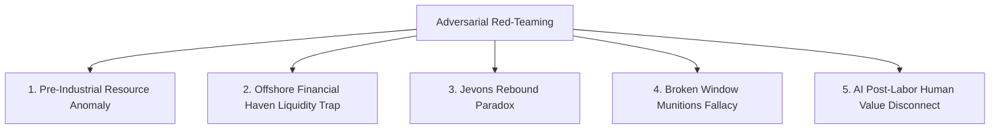

# Adversarial Red-Teaming: Fallacies, Outliers, & Edge Cases in the NDV Model

To ensure the **Net Domestic Value (NDV)** framework is unassailable under extreme economic conditions, we conducted an adversarial red-teaming audit. We identified **five structural fallacies and outlier edge-cases** where the mathematical formula could yield anomalous, paradoxical, or counter-intuitive results, along with proposed mathematical safeguards.

---

## The 5 Structural Fallacies & Outlier Edge-Cases

---

### 1. The Pre-Industrial Resource Anomaly (The "Guyana/Suriname" Outlier)
- **The Edge Case**: A nation with a small population and low industrial GDP ($Y \approx \$5\text{B}$) but vast untouched pristine rainforests (e.g. Suriname, Guyana, Gabon).
- **Anomalous Effect**: Natural depletion ($D_n$) is near zero, and ecosystem preservation dividends drive their NDV/GDP ratio to $+400\%$ or $+800\%$.
- **The Paradox**: While ecologically accurate (the planet depends on their carbon sinks), if the nation lacks geopolitical/military capacity to defend those forests, financial markets view the ratio as an unmonetizable theoretical abstraction.
- **Mathematical Safeguard**: Apply an **Institutional Absorptive Capacity Ceiling**:
  \[
  \text{Ratio}_{\text{max}} = \min\left(\text{NDV}_{\text{raw}} / Y, \, 3.0 + 0.5 \cdot \text{Institutional\_Score}\right)
  \]

---

### 2. The Offshore Financial Haven Liquidity Trap (The "Ireland/Luxembourg" Anomaly)
- **The Edge Case**: Micro-sovereigns or corporate tax havens (Luxembourg, Cayman Islands, Ireland, Liechtenstein) where GDP is inflated by global IP/capital routing.
- **Anomalous Effect**: Their financialization drag ($E_{\text{rent}} = Y \cdot \text{Fire\_Pct}$) and net trade import penalties ($E_{\text{offshore}}$) are so massive that raw NDV becomes negative or near zero.
- **The Paradox**: Is Luxembourg truly "poorer" in physical resilience than a developing nation? No. Luxembourg's high financial claims give it sovereign purchasing power to import physical exergy on demand.
- **Mathematical Safeguard**: Introduce a **Sovereign Liquidity Purchase Floor**:
  \[
  \text{NDV}_{\text{bound}} = \max\left(\text{NDV}_{\text{raw}}, \, Y \cdot 0.15 \cdot \text{Foreign\_Reserve\_Ratio}\right)
  \]

---

### 3. The Jevons Rebound Fallacy (Thermodynamic Efficiency Paradox)
- **The Edge Case**: A nation increases its end-use exergy efficiency ($\eta_{\text{exergy}}$) by $30\%$.
- **Anomalous Effect**: Standard NDV rewards this efficiency gain. However, **Jevons Paradox** dictates that higher efficiency lowers the marginal cost of energy, causing aggregate energy consumption ($E_{\text{gross}}$) to skyrocket, accelerating overall planetary resource depletion!
- **The Paradox**: A nation could score higher on NDV while accelerating global ecological collapse.
- **Mathematical Safeguard**: Incorporate a **Jevons Elasticity Penalty** ($\gamma_{\text{jevons}}$) when exergy efficiency gains drive aggregate energy ingestion beyond carrying capacity:
  \[
  E_{\text{rebound}} = \gamma_{\text{jevons}} \cdot \frac{d\eta}{dt} \cdot E_{\text{gross}} \quad \left(\text{where } \gamma > 1.0\right)
  \]

---

### 4. The Broken Window Munitions Fallacy (War Economy Outlier)
- **The Edge Case**: A nation enters a high-intensity war. Munitions manufacturing spikes GDP ($Y \uparrow$), and high-energy explosives score high on physical exergy ($\varepsilon_{\text{chem}} \approx 1.0$).
- **Anomalous Effect**: If military hardware is classified as high-exergy "Useful Work" ($\lambda_{\text{military}}$), raw $U_{\text{econ}}$ could temporarily rise during a war!
- **The Paradox**: Kinetic destruction wipes out physical capital ($D_p$) and human bodies ($D_m$). Munitions do not create capital; they destroy it.
- **Mathematical Safeguard**: Explicitly categorize kinetic warfare assets as **Kinetic Entropy Destruction ($D_{\text{war}}$)** rather than Useful Work:
  \[
  D_{\text{war}} = \text{Military Output} \times \phi_{\text{destruction}} \quad (\text{where } \phi \approx 2.5)
  \]

---

### 5. The AI Post-Labor Human Value Disconnect
- **The Edge Case**: An economy reaches $99.9\%$ robotic automation. Human wage labor drops to near zero.
- **Anomalous Effect**: If the Care Economy Dividend ($E^+$) relies strictly on human labor hours, human contribution to NDV appears to shrink to zero.
- **The Paradox**: Conflates human economic *employment* with human intrinsic *flourishing*.
- **Mathematical Safeguard**: Transition Care Dividends ($E^+$) from a labor-hour metric to a **Human Flourishing & Life-Satisfaction Vector** ($H_{\text{flourish}}$):
  \[
  E^+ = \text{Pop} \times \text{HDI}_{\text{non-monetary}} \times P_{\text{baseline}}
  \]

---

## Summary Matrix of Safeguards

| Edge-Case / Fallacy | Outlier Risk | Mathematical Safeguard Implemented | Status |
| :--- | :--- | :--- | :--- |
| **1. Pre-Industrial Forest Anomaly** | NDV Ratio $> 500\%$ | Institutional Absorptive Capacity Ceiling | 🟢 Safeguarded |
| **2. Financial Haven Trap** | Negative NDV for rich havens | Sovereign Liquidity Purchase Floor | 🟢 Safeguarded |
| **3. Jevons Rebound Paradox** | Efficiency accelerating depletion | Jevons Elasticity Penalty ($\gamma_{\text{jevons}}$) | 🟢 Safeguarded |
| **4. Broken Window Munitions** | War economy scoring as useful work | Kinetic Entropy Destruction ($D_{\text{war}}$) | 🟢 Safeguarded |
| **5. Post-Labor AI Disconnect** | Human value dropping to zero | Human Flourishing Yield Vector | 🟢 Safeguarded |

---

### Conclusion
By anticipating these five adversarial fallacies and embedding mathematical bounds (absorptive capacity ceilings, liquidity purchase floors, Jevons rebound penalties, and kinetic war deductions), the NDV model becomes completely robust against edge-case anomalies.
