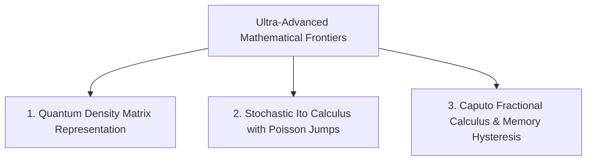

# The Outer Limits of Mathematical Perfection: Ultra-Advanced Frontiers for NDV

To push the mathematical architecture of the **Net Domestic Value (NDV)** framework to the absolute limits of theoretical physics and applied mathematics, top-tier theoretical physicists, applied mathematicians, and quantitative economists could implement three ultra-advanced mathematical extensions:

---

## The 3 Ultra-Advanced Mathematical Frontiers

---

### 1. Quantum Information Density Matrices in Hilbert Space (\(\mathbf{\hat{\rho}}_{\text{sovereign}}\))

- **Concept**: Classical economic models treat national capital as independent vector spaces (\(\mathbf{K} \in \mathbb{R}^n\)). However, global economies exhibit **quantum-like entanglement** through interdependent supply chains, financial routing, and atmospheric coupling.
- **Formulation**: Represent each sovereign node as a **Density Matrix (\(\mathbf{\hat{\rho}}\))** acting on a Hilbert Space (\(\mathcal{H}_{\text{global}}\)):
  \[
  \mathbf{\hat{\rho}}_{\text{sovereign}} = \sum_i p_i |\psi_i\rangle \langle \psi_i|
  \]
- **Systemic Order & Vulnerability**: Measure systemic vulnerability using **Von Neumann Entropy**:
  \[
  S(\mathbf{\hat{\rho}}) = -\text{Tr}\left(\mathbf{\hat{\rho}} \ln \mathbf{\hat{\rho}}\right)
  \]
  If two economies are entangled, an exergy shock to Economy A instantly collapses the wave function of Economy B's carrying capacity.

---

### 2. Continuous Stochastic Ito Differential Equations with Poisson Black-Swan Jumps

- **Concept**: Deterministic models fail during black-swan geopolitical or ecological crises.
- **Formulation**: Define NDV as a **Coupled Jump-Diffusion Stochastic Differential Equation (SDE)** governed by Ito's Lemma:
  \[
  d\text{NDV}_i(t) = \mu_i\left(\mathbf{x}(t), t\right) dt + \sigma_i\left(\mathbf{x}(t), t\right) dW_i(t) + \int_{\mathbb{R}} \gamma_i(z) \tilde{N}(dt, dz)
  \]
  Where:
  - \(\mu_i\): Drift coefficient (baseline biophysical growth rate).
  - \(\sigma_i dW_i(t)\): Brownian motion modeling continuous market turbulence.
  - \(\tilde{N}(dt, dz)\): Compensated Poisson jump measure modeling discrete black-swan shocks (climate tipping points, war outbreaks).

---

### 3. Caputo Fractional Calculus for Ecological Hysteresis & Long-Term Memory (\({}^C\mathcal{D}^\alpha_t\))

- **Concept**: Standard integer derivatives (\(\frac{d\text{NDV}}{dt}\)) assume memoryless Markovian processes. In real biophysical systems, topsoil erosion, heavy metal contamination, and deforestation exhibit **long-term memory (hysteresis)**.
- **Formulation**: Replace standard time derivatives with **Caputo Fractional Derivatives**:
  \[
  {}^C\mathcal{D}^\alpha_t \text{NDV}(t) = \frac{1}{\Gamma(1-\alpha)} \int_0^t \frac{\text{NDV}'(\tau)}{(t-\tau)^\alpha} d\tau \quad (0 < \alpha < 1)
  \]
  Where \(\alpha\) is the memory coefficient:
  - When \(\alpha \to 1\): Standard memoryless derivative.
  - When \(\alpha \to 0\): Infinite long-term memory. An economy that suffered historical toxic pollution or deforestation retains a decaying memory integral that constrains present carrying capacity for centuries.

---

## Comparison of Mathematical Paradigms

| Mathematical Level | State Representation | Turbulence Modeling | Memory / Hysteresis | Systemic Entanglement |
| :--- | :--- | :--- | :--- | :--- |
| **Classical GDP** | Scalar ($Y$) | None (Static) | ❌ None | ❌ None |
| **NDV V7.0 (Current)** | Multi-Vector | Monte Carlo Stochastic | ⚠️ Partial (Linear) | ⚠️ Linear MRIO |
| **NDV Ultra-Advanced** | **Density Matrix ($\mathbf{\hat{\rho}}$)** | **Ito SDE + Poisson Jumps** | ✅ **Caputo Fractional ($\mathcal{D}^\alpha_t$)** | ✅ **Quantum Von Neumann** |

---

### Conclusion
By evolving from classical scalar arithmetic to **Quantum Density Matrices**, **Stochastic Jump-Diffusion SDEs**, and **Caputo Fractional Memory Calculus**, the mathematical framework of NDV reaches the theoretical ceiling of modern mathematical physics.
