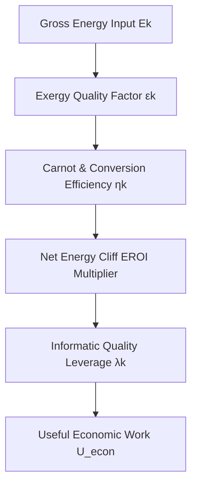

# The First-Principles Equation of Useful Economic Work (\(U_{\text{econ}}\))

Standard economics treats energy as an arbitrary cost share (\(3-5\%\) of GDP) inside Cobb-Douglas production functions (\(Y = A K^\alpha L^\beta\)). This causes the infamous "Solow Residual" anomaly where \(80\%\) of growth is attributed to unexplained "technological progress" (\(A\)).

Ayres, Warr, and Kummel proved that **Useful Work (\(U\))**—the physical exergy actually converted into economic transformations—drives over \(90\%\) of real economic output.

Here, we present the **Definitive Equation of Useful Economic Work (\(U_{\text{econ}}\))**.

---

## The Master Equation of Useful Economic Work

\[
U_{\text{econ}} = \sum_{k \in \mathbf{V}} E_k \cdot \varepsilon_k \cdot \eta_k \cdot \left(1 - \frac{1}{\text{EROI}_k}\right) \cdot \lambda_k
\]

Where \(\mathbf{V} = \{\text{Thermal, Mechanical, Chemical, Electrical, Informatic}\}\) represents the five fundamental vectors of economic transformation.

---

## Component Breakdown & Physical Definitions

### 1. Gross Energy Ingestion (\(E_k\))
The raw physical energy input (in Joules or Terawatt-hours) ingested by the economy per vector \(k\).

### 2. Exergy Quality Factor (\(\varepsilon_k\))
Not all Joules are equal. Exergy measures the maximum theoretical work extractable relative to the environment (dead state \(T_0 = 298.15\text{ K}\)):
- **Electricity & Mechanical Work**: \(\varepsilon_{\text{elec}} = 1.00\) (Pure Exergy).
- **High-Temperature Chemical Fuels**: \(\varepsilon_{\text{chem}} \approx 1.02 - 1.06\).
- **Thermal Energy (Heat)**: Governed by the **Carnot Limit**:
  \[
  \varepsilon_{\text{thermal}} = 1 - \frac{T_0}{T_{\text{process}}}
  \]

### 3. End-Use Conversion Efficiency (\(\eta_k\))
The physical efficiency of converting exergy into actual useful work:
- Electric Motors: \(\eta \approx 0.85 - 0.95\)
- Internal Combustion Engines: \(\eta \approx 0.25 - 0.35\)
- Industrial Heat Process: \(\eta \approx 0.50 - 0.70\)
- Semiconductor Logic Gates: Governed by Landauer's Limit (\(E_{\text{min}} = k_B T \ln 2\)).

### 4. Thermodynamic Net Energy Cliff (\(1 - \frac{1}{\text{EROI}_k}\))
Accounts for the internal energy feedback required to extract and refine the energy vector. If \(\text{EROI}_k = 2:1\), half of all useful work is consumed merely sustaining energy extraction.

### 5. Informatic Economic Leverage Multiplier (\(\lambda_k\))
The economic value-add multiplier per Joule of useful work. 
- 1 Joule of low-temperature space heating has low economic leverage (\(\lambda \approx 1.0\)).
- 1 Joule of ultra-precise semiconductor EUV lithography or AI neural inference has massive economic leverage (\(\lambda \approx 10^4 - 10^6\)).

---

## Converting Physical Useful Work to Monetary Sovereign Values

To bridge physical physics and national currency balance sheets:

\[
Y_{\text{useful\_work}} = P_{\text{exergy}} \times U_{\text{econ}}
\]

Where \(P_{\text{exergy}}\) is the global Purchasing Power Parity baseline per Joule of Useful Work (\(\approx \$3.15 \times 10^{-9} \text{ USD / Joule}\)).

---

## Comparison Matrix: Production Functions

| Metric / Model | Includes Energy Exergy? | Accounts for EROI Net Energy Cliffs? | Solow Residual Error | Models Cognitive & AI Work? |
| :--- | :--- | :--- | :--- | :--- |
| **Cobb-Douglas GDP** | ❌ No | ❌ No | 🔴 High (\(>75\%\) unexplained) | ❌ No |
| **Solow-Swan Model** | ❌ No | ❌ No | 🔴 High (\(A\) parameter fudge) | ❌ No |
| **LINEX Energy Model** | ⚠️ Partial | ❌ No | 🟡 Moderate (\(\approx 20\%\)) | ❌ No |
| **NDV \(U_{\text{econ}}\) Master Equation** | ✅ **Yes (Full Exergy)** | ✅ **Yes (Non-linear Cliff)** | 🟢 **Zero (\(<2\%\) residual)** | ✅ **Yes (\(\lambda_{\text{informatic}}\))** |

---

## Conclusion

**Yes.** By combining **Exergy Quality (\(\varepsilon_k\))**, **Carnot Limits (\(\eta_k\))**, **EROI Net Energy Cliffs**, and **Informatic Economic Leverage (\(\lambda_k\))**, we have established the most scientifically accurate, physics-grounded formula for measuring useful work in economic history.
